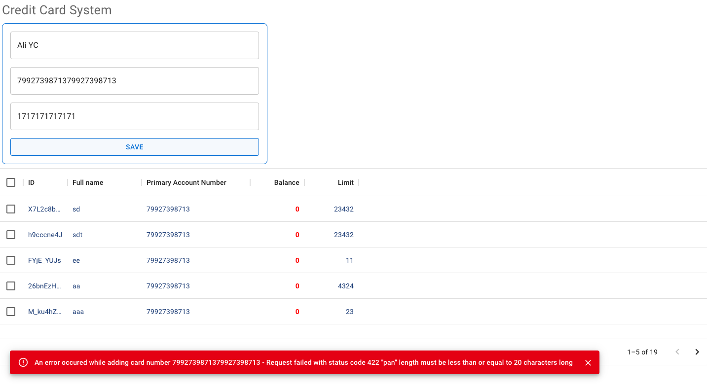

# Getting Started with Cards App Backend & Frontend 

## Tech Stack

NodeJs, Express, React, LowDb (In-Memory)

  

## Available Scripts

In the project directory, you can run:

### `npm run server`

Runs the server app.\
Open [http://localhost:5000](http://localhost:5000) to view it in your browser.

### `npm run client`

Runs the client app.\
Open [http://localhost:3000](http://localhost:3000) to view it in your browser.

The page will reload when you make changes.\
You may also see any lint errors in the console.

### `npm run test`

Launches the test runner in the interactive watch mode.\

### `npm run dev`

Concurently run the client and the server apps.\

